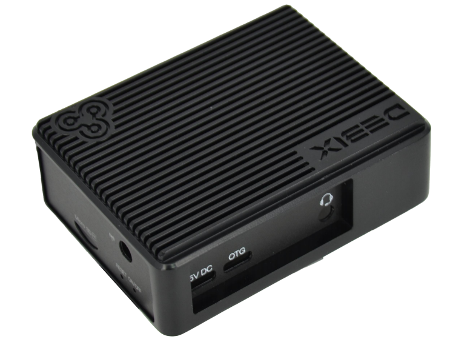
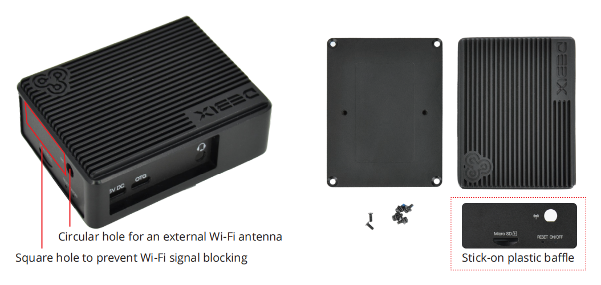
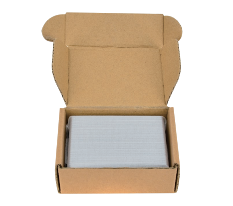
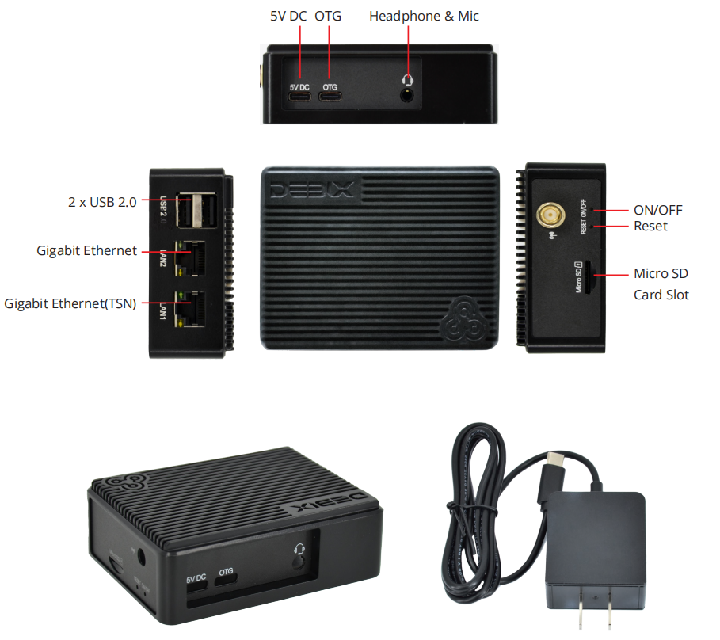

# DEBIX Fanless Aluminum Enclosure
 

## Overview
This fanless aluminum enclosure is designed specifically for DEBIX Model C. Due to its small form-factor design, it has an increased surface area for enhanced heat dissipation while retaining access to all of the ports.

## Main Features:
- Can be used with DEBIX Model C
- Rigid aluminum alloy enclosure
- Increased surface area for enhanced heat dissipation
- The right side of the enclosure is designed with a square hole and a stick-on plastic baffle to prevent Wi-Fi signal blocking
- A circular hole is reserved on the right side for an external Wi-Fi antenna

--- 
### Packing List:  
- 1 pc aluminum alloy enclosure 
- All screws needed
- 1 pc conductive rubber pad

### Specification:
- Enclosure dimension: 93.47mm x 72.36mm x 30.15mm
- Net weight: 0.149KG (Rubber pad not included)

## Installed with DEBIX Model C:

***Notice:***   The package does not include the DEBIX Model C and power adapter.

## Contact Us
- **Headquarters**: DEBIX Technology Inc., 8345 Gold River Ct., Las Vegas, NV 89113, USA  
- **Factory**: 5-6/F., East Zone, Shunheda A2 Building, Liqxiandong Industrial Park, XiLi, Nanshan Dist., Shenzhen, China  
- **Email**: info@debix.io  
- **Website**: [www.debix.io](https://www.debix.io)  
- **Community**: [Discord](https://discord.com/invite/adaHHaDkH2)